# LocalDeck Lightswitch Mount - WORK IN PROGRESS

This is a write up of my LocalDeck Deployment which adds 24 buttons with status LED's to a standard (UK) light switch with no permanent wall modifications.

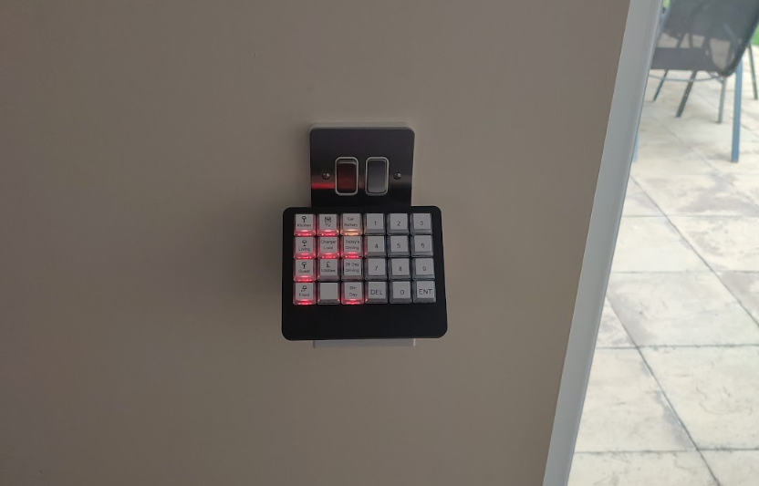

This write up will focus more on the hardware side of the project as software is highly specific to my home assistant setup.

## The Process

To start with I got a standard single gang 45 degree backbox and put the localdeck on it to see how it would look.

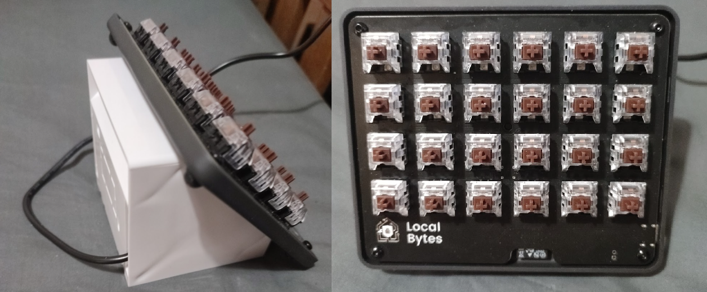

it works extremely well and if you are looking for a more solid stand for the LocalDeck which is at a higher angle and lets you use the rear USB port then getting one of these is great solution.

Now that the entire premise of the idea was green lit I moved to modifing the backbox so that it could easily be mounted to a light switch without permanently modifing the original setup. For this I opted to get a faceplate spacer and attch this to the top of the backbox.

This required grinding part of the spacer down to get a flat surface then drill some holes in both the spacer and the backbox and use M2 bolts to hold them together. I then drilled a few extra holes at the join and in the backbox for cables to be routed from the switch to the backbox. This is how I will power the setup as I have both live and neutral at the intended switch.

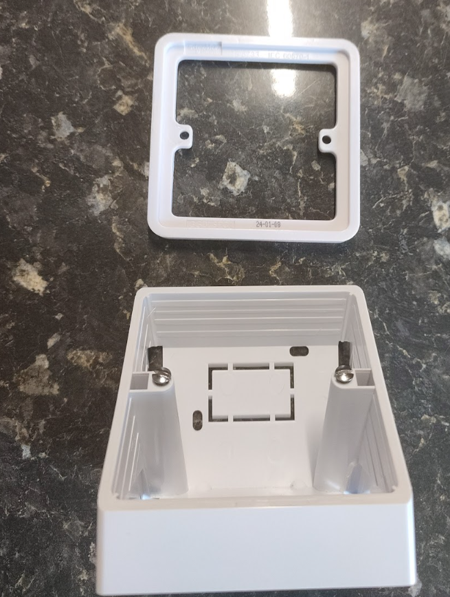
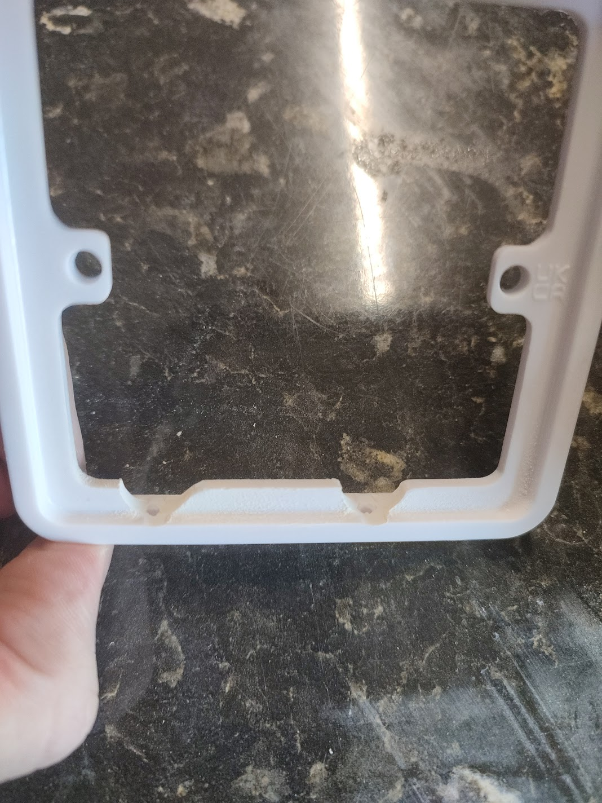
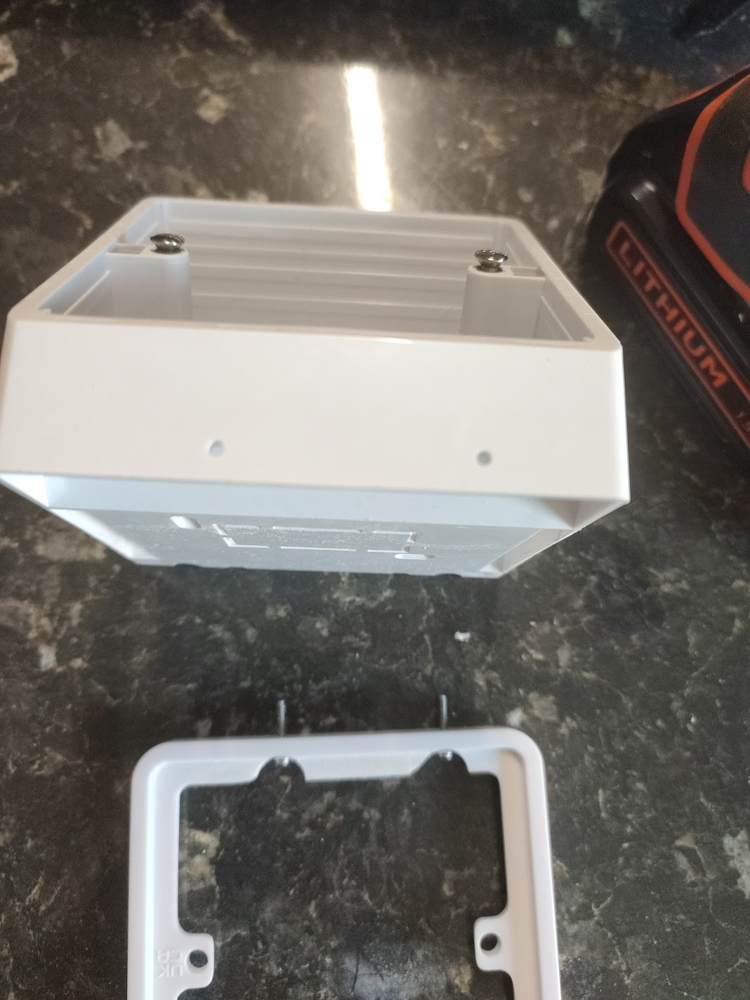
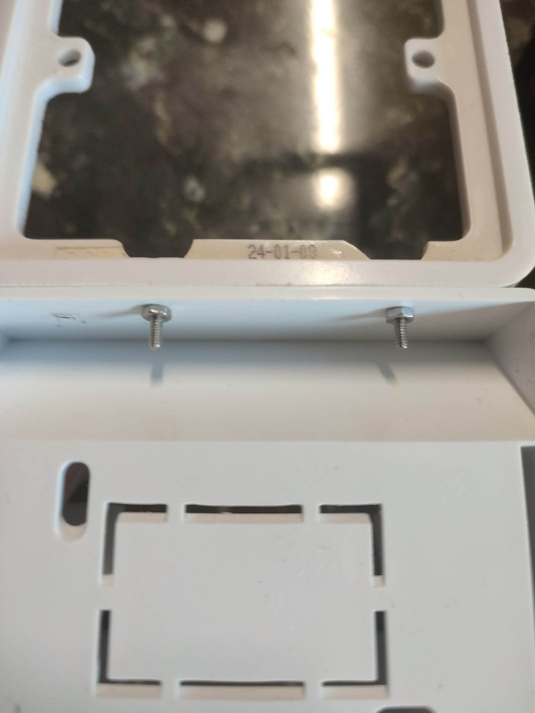
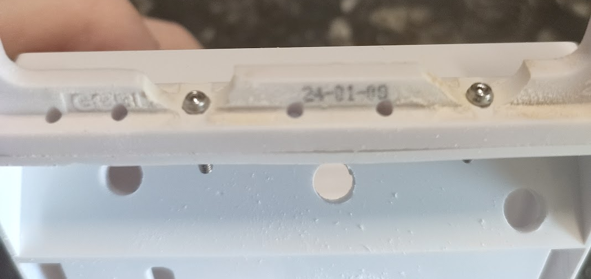
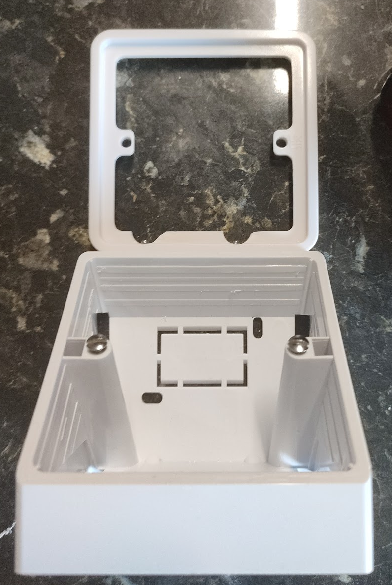

Once this was on I noted that the angle of the localdeck was such that it would potentially interfere with the light switch when it was in palce so I opted to add a spacer to the front of the backbox to give enough room.

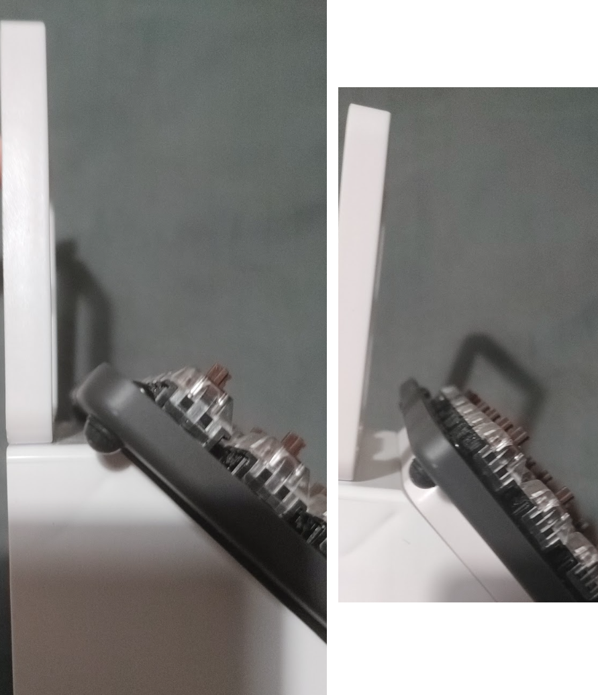

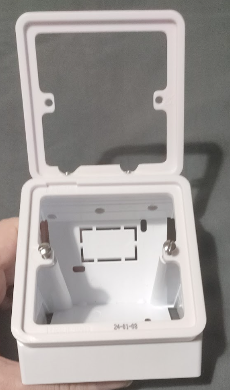

TODO PHOTO

Now with the framework ready it was time to deccide on the wiring.

It was at this point I decided to modify the LocalDeck and add wires to the unpopuated connections on the board. I feeel i could have made do with the rear USB connection but a such a connector at the angle it would be may limit some future options. and given the connections were already ready to accept the modification it seemed easy enough to just solder on a couple of wires. I used some kapton type to hold the wire in position as I routed it to the rear usb connector which conveniently had space on its side to allow the cables to pop out. I also put Kaptop tape in behind where the keyhole mounts on the rear panel are. This is to ensure that if the screw is too long and touches the board that it will not be able to short anything.

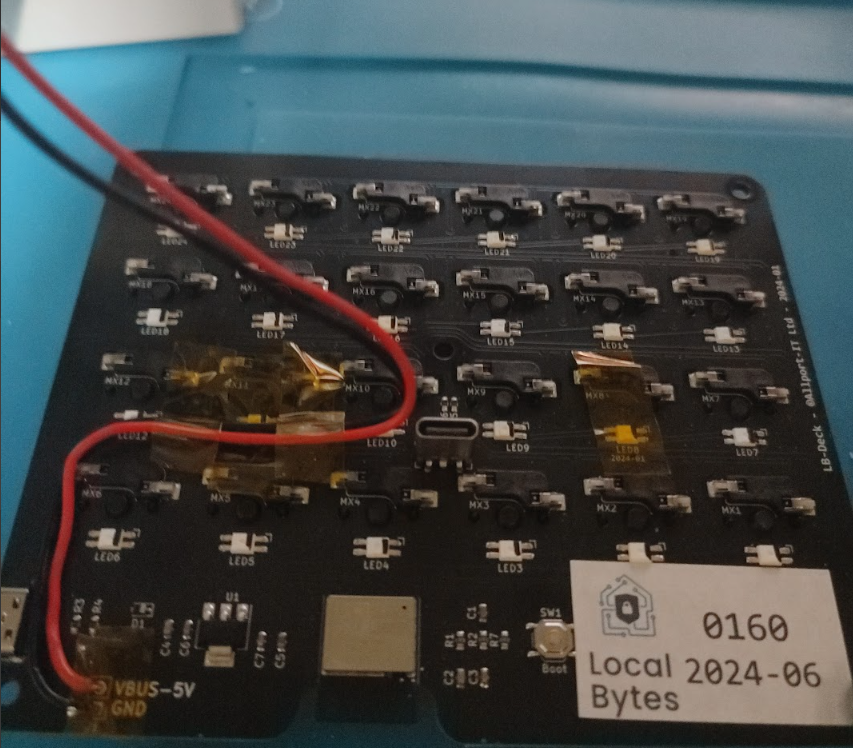

I used a small 5v power supply with a max output of 2.4A. please note that the localdeck orginal PSU is rated at 3A. during testing i noted it didnt get much over an amp (maybe 1.2 at most) however to be sure I also limited the brightness of the LEDS (main power consumer) to 80% brightness in firmware. at 80% brightness they use about 50% power

I used Wago Connectors on both the 230v and the 5v circuits to ensure a solid connection which making it easy to disconnect and also add additional things later (will cover ideas later)

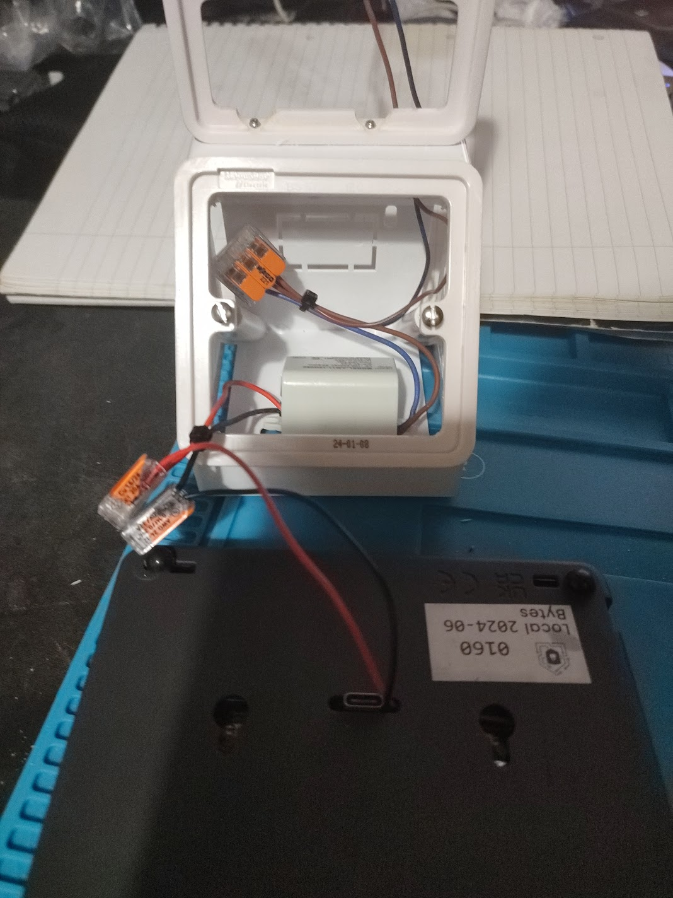

Now when almost ready for deployment It was time to put the faceplate and custom keys on the LocalDeck and I have to say that it does look really smart once fully assambled.

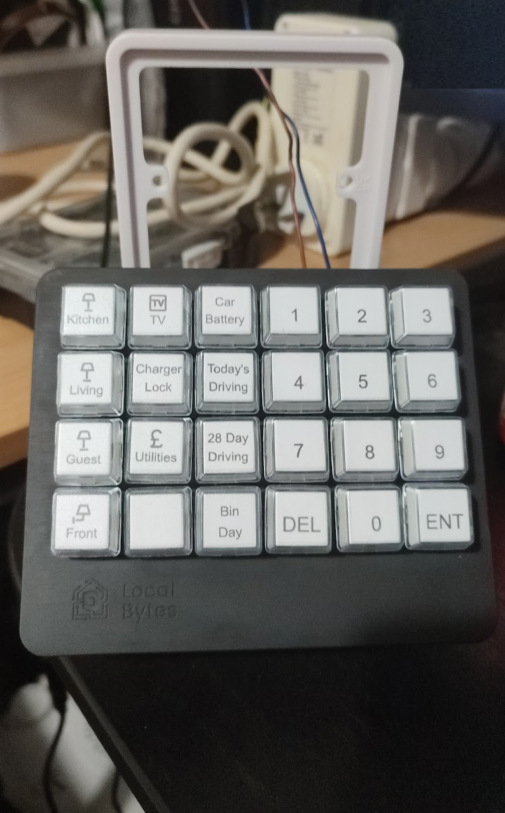

Now was time to work on the software side of things. This is mostly a hardware write up and the software is very specific but I will note that I did customise the firmware a bit and I use Two automations to control everything. One Handles button presses and the other updates the LEDS as required. For feedback/device stauts/battery indicator/etc...

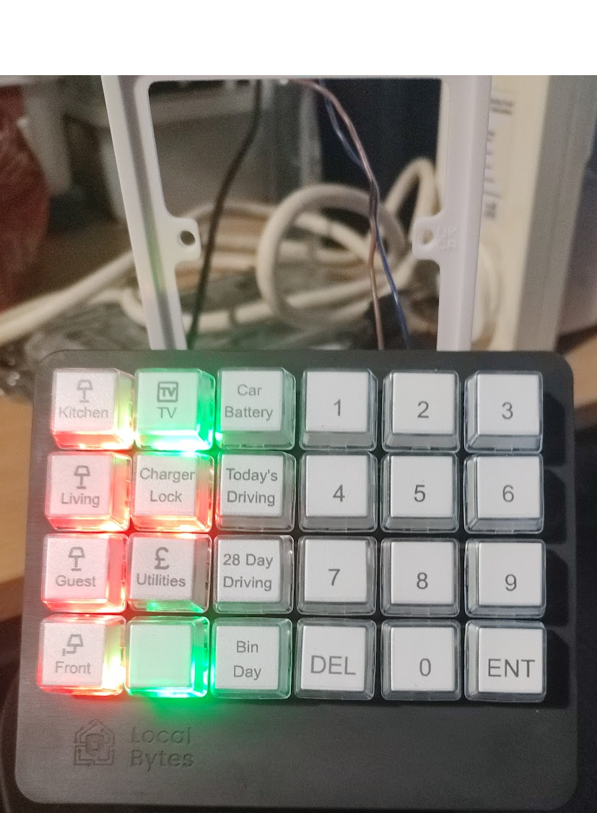

Once ready It was time to Mount it to the light switch. If your doing this kind of thing please ensure that the power to the lighting circuit is switched off.

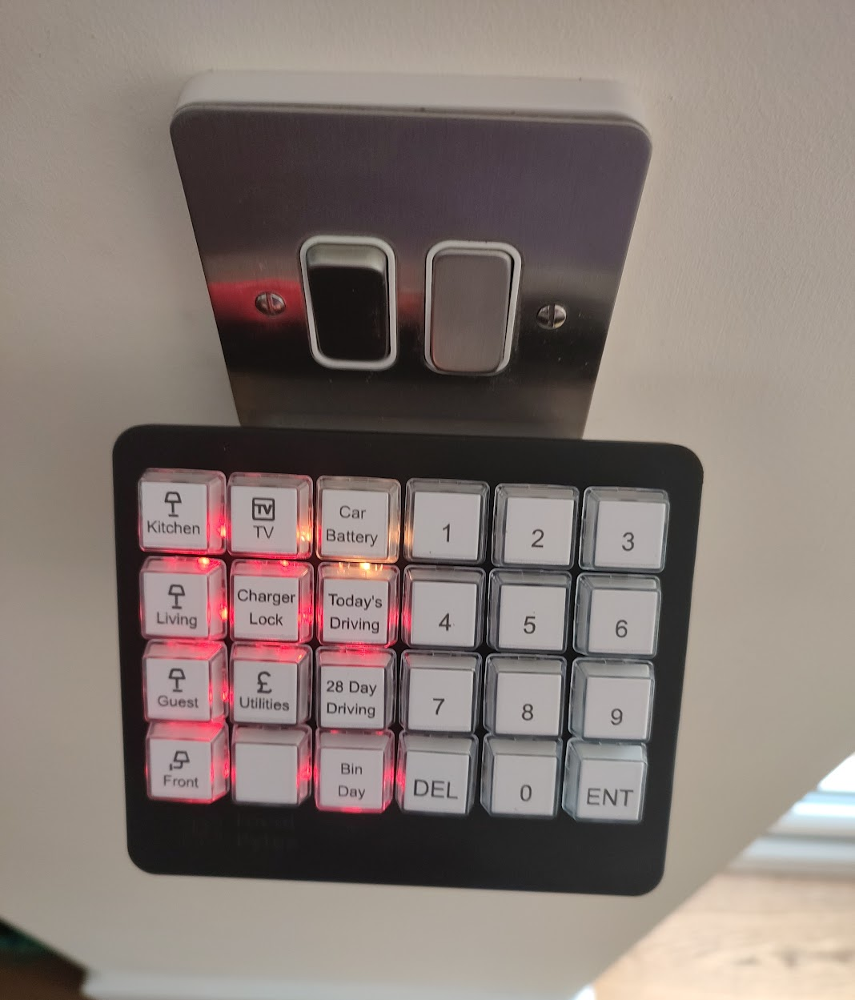
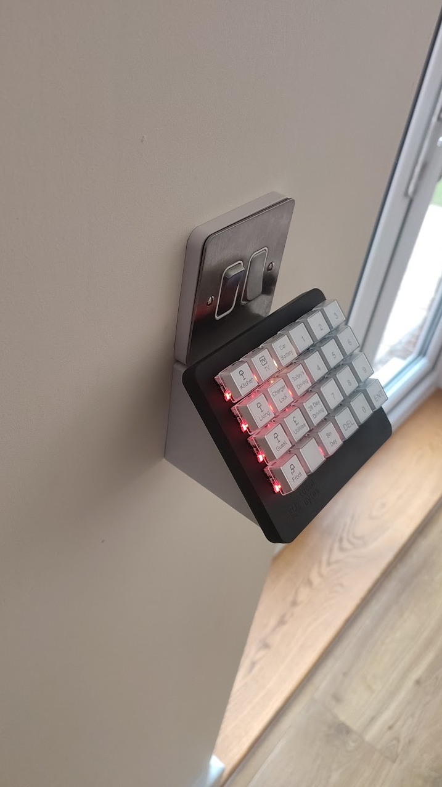

## Issues

The keypad is a little close to the switches so I may modify the backpanel to extend the keyhole slots to allow it to drop down a little further

With the keyhole mounting system it could be easily pushed out of position potentially exposing access to live mains. this does pose a small safety risk but given the holdhold it is limited. However maybe adding a retention system of some sort might be a good idea. A single screw somewheere should probably do it.

## Further Plans

There is plenty more room for activities inside the backbox and I am considering adding a second ESP32 setup to the deployment. Which could have various things attached to it: sensors/voice assistant/relays for the lights/etc...

I am pretty sure I will revisit this little implacement soon and will potentially detail modfications in a future write up.

## Conclusion

I am very happy with the way it has turned out and It has gone down well with other members of the household.

Being able to put something that looks "built in" in place without permanent modification to walls and such is a big bonus.

## Shout out to LocalBytes who made the LocalDeck

They are a great company that make excellent value products. They have had some issues but have resolved them and acted better than most companies 1000 times their size. if your in the market for some smart home stuff then check them out.

## Further Reading

My LocalDeck Review/Feedback write up - https://github.com/MichaelMKKelly/LocalDeck-Review/

LocalDeck Product Page: https://www.mylocalbytes.com/products/localdeck-bundle

LocalDeck Documentation: https://blog.mylocalbytes.com/kb/2024-04-01/refs-localdeck/

Localbytes Website: https://www.mylocalbytes.com/
